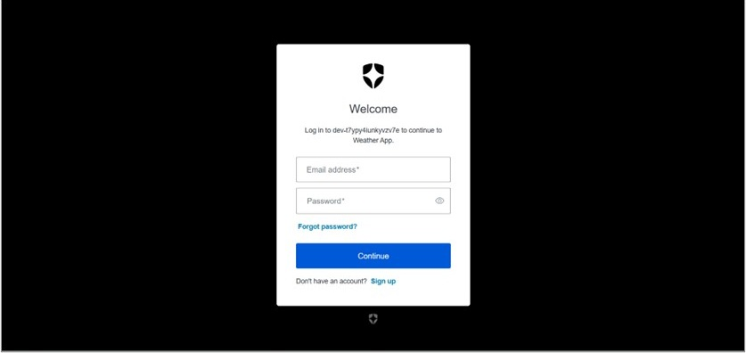
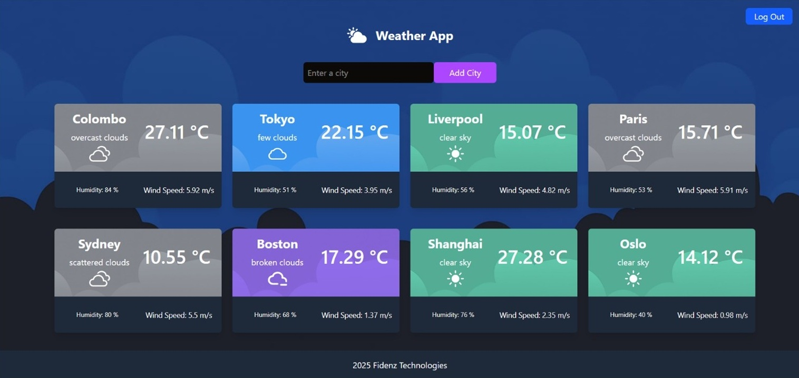
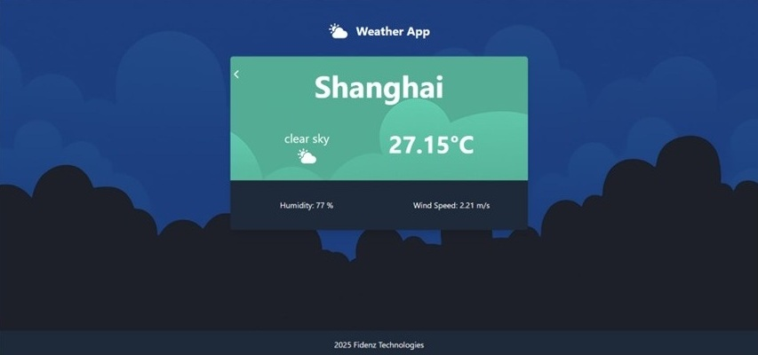
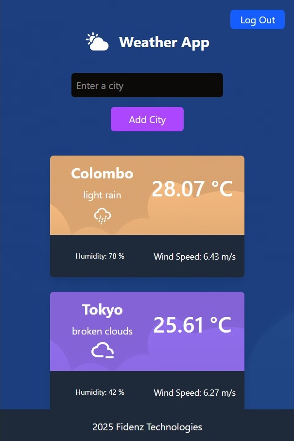

# Weather App 🌦️ - Frontend

## About The Project

The **Weather App** provides users with real-time weather updates, featuring a clean and interactive interface to check weather conditions across cities worldwide. Built with the **MERN stack** (MongoDB, Express.js, React.js, and Node.js), the app allows users to securely log in, view personalized weather data, and receive up-to-date weather forecasts.

Key functionalities include secure authentication via **Auth0**, live weather data fetched from the **OpenWeatherMap API**, and a responsive user interface for both mobile and desktop devices.

### Built With

- **Frontend**: React.js, Vite, TailwindCSS  
- **Backend**: Node.js, Express.js (refer to the backend repository)  
- **Authentication**: Auth0 (with optional Multi-Factor Authentication)  
- **Weather Data**: OpenWeatherMap API  
- **Caching**: NodeCache for performance optimization  

---

## Screenshots

### 🔐 Login Page  


### 🌤️ Weather Dashboard  


### 🌤️ Weather results for a specific city 


### 📱 Mobile View  


---

## Key Features

- 🌍 **Global Coverage**: View weather conditions for cities around the world  
- 🔐 **Secure Authentication**: Auth0 login with optional MFA  
- 🌡️ **Real-Time Weather Data**: Temperature, humidity, wind speed, and more  
- 📱 **Responsive Design**: Optimized for mobile, tablet, and desktop  
- ⚡ **Efficient Caching**: Reduces API calls with 5-minute cache window  

---

## Getting Started

Follow these steps to get the Weather App up and running locally.

### Prerequisites

Make sure you have the following installed:

- [Node.js](https://nodejs.org/) (v14 or higher)  
- npm (Node Package Manager)  
- Git  
- Auth0 Account  

---

### Setup Instructions

#### 1. Clone the Repositories

```bash
git clone https://github.com/Thisakya-Anudini/WeatherApp-FE
git clone https://github.com/Thisakya-Anudini/WeatherApp-BE
```

#### 2. Install Dependencies

**Backend:**

```bash
cd weatherapp_backend  
npm install
```

**Frontend:**

```bash
cd weatherapp_frontend  
npm install
```

#### 3. Set Up Environment Variables

Create a `.env` file in the **backend** directory:

```env
API_KEY=OpenWeatherMap API key for fetching weather data
AUTH0_DOMAIN= Auth0 Domain 
API_IDENTIFIER=The identifier (audience) for your API 
FRONTEND_URL=URL of your frontend app 
PORT=The port the backend server will run on

```

Create a `.env` file in the **frontend** directory:

```env
VITE_AUTH0_DOMAIN=your_auth0_domain 
VITE_AUTH0_CLIENT_ID=Auth0 Client ID  
VITE_BACKEND_URL=Backend URL

```

Create a `.env` file in the **frontend** directory and add any necessary variables.

#### 4. Run the Application

**Backend:**

```bash
cd weatherapp_backend
npm start
```

Backend will run at: `http://localhost:5000`

**Frontend:**

```bash
cd weatherapp_frontend 
npm run dev
```

Frontend will run at: `http://localhost:5173`


---

## Technologies and Tools Used

- **React.js** – Dynamic frontend UI  
- **Vite** – Fast build tool for development  
- **TailwindCSS** – Utility-first CSS framework  
- **Node.js** – Backend runtime environment  
- **Express.js** – API routing and server logic  
- **Auth0** – Authentication and MFA  
- **OpenWeatherMap API** – Real-time weather data  
- **NodeCache** – In-memory caching for performance  


